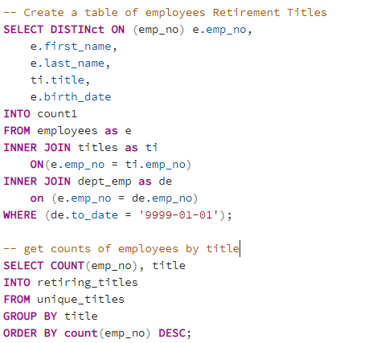
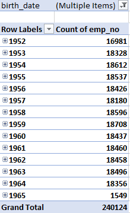
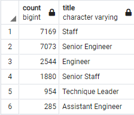

# Pewlet-Hackard-Analysis
The purpose of this project is to identify the number of employees at Pewlet Hackard who may retire in the next few years.  Once complete we wanted to identify any risks or areas in need of attention during this time to reduce risk and negative financial impact due to potential reduced knowledge and staffing in the afected areas.

## Results
- 30% of the workforce fits into the listed criteria and may be retiring in the near future.
- The area of most concern is in our Senior staffing.
- Records indicate that there are no employees at the company born after 1965 which presents a major risk to the company and potential litigation based on hiring practices.

- The Mentorship Program should be expanded to include more employees.

## Summary

- Of the 240,124 people currently employed 72,458 are born between 1952 & 1955 and will likely retire in the near future.  This represents 30% of the workforce
The lowest percentage reduction for a role is 22% (Manager) while all other titles (Assistant Engineer, Technique Leader, Staff, Engineer, Senior Staff, & Senior Engineer) are facing a 30% reduction.
- The mentorship program as targeted thus far would result in 1549 employees in the program.  This would allow us to immediately fill 2% of the employee population expected to retire.
- If we expanded the mentorship program to include any employee born in 1964 as well the program would then include a total of 19,905 employees and fill 30% of the employee population expected to retire.
- we need to put additional focus on our ability to promote our staff to senior staff and then backfill the staff role with newer employees or hiring people to fill the senior staff role externally as the mentorship program would at best would be able to reduce the attrition by 8%.
- As it stands with the suggested increase in the mentorship class there would be at worst a 1:1 (Staff level) and an at best 1:13 (Senior Staff level) Mentee to Mentor ratio.

